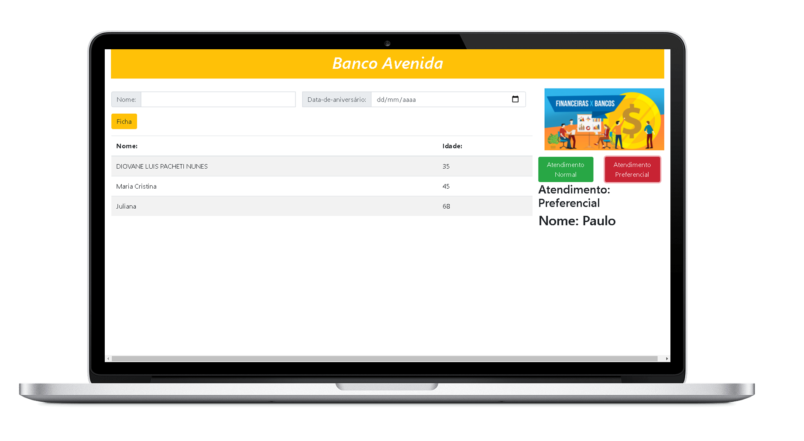

<h1 align="center">Banco Avenida</h1>

<p align="center">
    
    
</p>



## Tecnologias Utilizadas no projeto :construction:

- [Node.js](https://nodejs.org/en/) 
- [ReactJS](https://pt-br.reactjs.org/) 
- [ReactHookForm](https://react-hook-form.com/) 
- [reac-notificações](https://www.npmjs.com/package/react-notifications)
## Projeto :computer:

### - Trabalho 

- Criar um novo projeto para cadastrar dados em localStorage utilizando React Hooks, com as seguintes
considerações:
* O programa deve apresentar layout semelhante ao da Revenda Herbie e controlar a fila dos clientes
de um banco.
* Ler nome e idade do cliente. Validar os dados de entrada. Salvar em localStorage. Exibir na listagem
nome, idade e atendimento (normal ou preferencial).
* O programa deve exibir 2 botões “Atendimento Normal” e “Atendimento Preferencial” - ao ser clicado,
retirar da lista o 1º cliente que corresponda ao atendimento. Exibir o nome do cliente em atendimento.
Exibir mensagem caso não tenha cliente na fila do atendimento disponível.


> - create-react-app
>
> ```npx create-react-app ```


## Como executar :gear:

- Clone o repositório `https://github.com/DioenDJS/Banco-Avenida`.
- Install as dependências com o comando `npm install`.
- Rode o `npm start` para iniciar a aplicação.<br />
Ao final a aplicação estará disponível em `http://localhost:3000`.


## utilizado no projeto :page_with_curl:

- [Bootstrap](https://maxcdn.bootstrapcdn.com/bootstrap/4.5.2/css/bootstrap.min.css)

inserir no head do index.html no diretório public
```
<link rel="stylesheet" href="https://maxcdn.bootstrapcdn.com/bootstrap/4.5.2/css/bootstrap.min.css" />
```

- [FontAwesome](https://www.w3schools.com/bootstrap4/bootstrap_icons.asp)

inserir no head do index.html no diretório public
```
<link rel="stylesheet" href="https://use.fontawesome.com/releases/v5.7.0/css/all.css" />
```


## Dependências do Projetos :card_index_dividers:


> - React Hook Form
>
> ``npm install react-hook-form``

> - reac-notificações
>
>``npm install react-notifications``